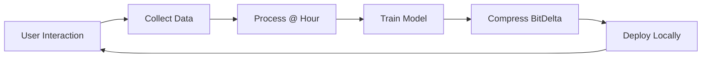

# HIP-22: Personalized AI - Own Your AI

## Abstract

This proposal defines the "Own Your AI" system - continuous personalization of language models through user interactions. Every hour, conversations are used to fine-tune personal models using BitDelta compression, creating ultra-compact (<100KB) personalized AI assistants.

## Motivation

Current AI systems are:
- Generic and not personalized
- Centralized with privacy concerns
- Large and expensive to deploy
- Static without continuous learning

We need AI that:
- Learns from your specific patterns
- Runs locally with full privacy
- Compresses to kilobytes not gigabytes
- Improves continuously from usage

## Specification

### Architecture

```yaml
pipeline:
  collection:
    - Capture user-LLM conversations
    - Extract patterns and preferences
    - Generate training examples
    
  processing:
    - Clean and validate data
    - Create instruction pairs
    - Generate synthetic augmentations
    
  training:
    - Fine-tune base model
    - Apply BitDelta compression
    - Validate quality metrics
    
  deployment:
    - Push to user's local node
    - Update routing preferences
    - Monitor performance
```

### BitDelta Compression

BitDelta enables extreme model compression:

```python
class BitDeltaCompressor:
    """Compress fine-tuned models to <100KB"""
    
    def compress(self, base_model, fine_tuned_model):
        # Compute weight deltas
        delta = fine_tuned_model - base_model
        
        # 1-bit quantization
        sign_matrix = torch.sign(delta)
        scale_factor = torch.abs(delta).mean()
        
        # Pack bits efficiently
        packed = self.pack_bits(sign_matrix)
        
        return {
            'bits': packed,  # ~50KB for 7B model
            'scale': scale_factor,
            'metadata': {...}  # <50KB
        }
        
    def decompress(self, base_model, bitdelta):
        # Unpack bits
        sign_matrix = self.unpack_bits(bitdelta['bits'])
        
        # Reconstruct model
        delta = sign_matrix * bitdelta['scale']
        return base_model + delta
```

### Continuous Learning Loop



### Privacy Tiers

```yaml
tier_0:
  name: Cloud Training
  location: Hanzo servers
  encryption: TLS
  suitable_for: Non-sensitive data
  
tier_1:
  name: Edge Training
  location: User's edge device
  encryption: Local only
  suitable_for: Personal data
  
tier_2:
  name: TEE Training
  location: Confidential compute
  encryption: Hardware-backed
  suitable_for: Sensitive enterprise
  
tier_3:
  name: Homomorphic Training
  location: Encrypted computation
  encryption: FHE
  suitable_for: Maximum privacy
```

## Implementation

### Data Collection

```python
class InteractionCollector:
    def __init__(self):
        self.buffer = []
        self.scheduler = AsyncScheduler()
        
    async def collect(self, interaction):
        """Collect user-LLM interaction"""
        self.buffer.append({
            'timestamp': time.time(),
            'messages': interaction.messages,
            'context': interaction.context,
            'feedback': interaction.feedback
        })
        
    async def process_hourly(self):
        """Process buffer every hour"""
        if len(self.buffer) > MIN_SAMPLES:
            dataset = self.create_dataset(self.buffer)
            await self.trigger_training(dataset)
            self.buffer.clear()
```

### Training Pipeline

```python
class PersonalTrainer:
    def __init__(self, base_model='hanzo/hllm-7b'):
        self.base = load_model(base_model)
        self.lora_rank = 8  # Low-rank adaptation
        
    async def train(self, dataset):
        """Fine-tune on personal data"""
        # Apply LoRA for efficiency
        lora_model = apply_lora(self.base, rank=self.lora_rank)
        
        # Train on user data
        for batch in dataset:
            loss = lora_model.train_step(batch)
            
        # Merge LoRA weights
        fine_tuned = merge_lora(self.base, lora_model)
        
        # Compress with BitDelta
        bitdelta = BitDeltaCompressor().compress(
            self.base, fine_tuned
        )
        
        return bitdelta
```

### Deployment

```python
class PersonalModelDeployer:
    async def deploy(self, bitdelta, user_id):
        """Deploy personal model to user's device"""
        
        # Sign with user's key
        signature = self.sign(bitdelta, user_id)
        
        # Encrypt for transport
        encrypted = self.encrypt(bitdelta, user_id)
        
        # Push to user's node
        await self.push_to_node(
            user_id=user_id,
            model=encrypted,
            signature=signature,
            version=self.next_version()
        )
        
        # Update routing table
        await self.update_routing(user_id, 'personal')
```

## Storage Format

```yaml
# Personal model manifest
model:
  id: pm_2024_01_20_14_00
  user: user_abc123
  base: hanzo/hllm-7b
  
bitdelta:
  size: 87KB
  compression: 1bit
  scale: 0.0023
  
training:
  samples: 523
  duration: 4m32s
  loss: 0.124
  
versioning:
  previous: pm_2024_01_20_13_00
  signature: 0x1234...
```

## API

```yaml
# Training API
POST /api/personalization/train
  Trigger training on collected data
  
GET /api/personalization/status
  Get training pipeline status
  
# Model API  
GET /api/personalization/models
  List personal models
  
POST /api/personalization/deploy
  Deploy model to device
  
# Privacy API
POST /api/personalization/privacy
  Set privacy tier (0-3)
  
DELETE /api/personalization/data
  Delete collected data
```

## Security

### Model Signing

```python
def sign_model(bitdelta, private_key):
    """Sign model with user's key"""
    hash = sha256(bitdelta.bytes)
    signature = ecdsa_sign(hash, private_key)
    return signature
    
def verify_model(bitdelta, signature, public_key):
    """Verify model authenticity"""
    hash = sha256(bitdelta.bytes)
    return ecdsa_verify(hash, signature, public_key)
```

### Encryption

```python
def encrypt_model(bitdelta, user_key):
    """Encrypt model for user"""
    # Use ML-KEM (post-quantum)
    ciphertext = ml_kem_encrypt(
        bitdelta.bytes,
        user_key
    )
    return ciphertext
```

## Performance

### Metrics

```yaml
compression:
  original: 14GB (7B model)
  bitdelta: 87KB
  ratio: 160,000:1
  
inference:
  base_speed: 50 tok/s
  personal_speed: 48 tok/s
  overhead: 4%
  
training:
  samples_required: 100+
  training_time: <5 min
  gpu_memory: 8GB
```

### Benchmarks

```yaml
quality:
  perplexity_increase: +0.2
  task_accuracy: -1.3%
  personalization_score: +47%
  
efficiency:
  storage: 99.99% reduction
  bandwidth: 99.99% reduction
  deployment_time: <1s
```

## Privacy Guarantees

1. **Local First**: Training happens on user's device when possible
2. **Encryption**: All data encrypted at rest and in transit
3. **User Control**: Users own their models and data
4. **Right to Delete**: Complete data removal on request
5. **Audit Trail**: Cryptographic proof of training data

## Integration

### With Hanzo IDE (HIP-21)

```python
# In IDE backend
collector = InteractionCollector()

@websocket.on('chat_message')
async def on_chat(message):
    # Collect interaction
    await collector.collect(message)
    
    # Use personal model if available
    if has_personal_model(user_id):
        response = await personal_inference(message)
    else:
        response = await base_inference(message)
        
    return response
```

### With Hanzo Node (HIP-20)

```yaml
# Node configuration
compute:
  personalization:
    enabled: true
    interval: 3600  # 1 hour
    min_samples: 100
    privacy_tier: 2  # TEE
```

## Future Work

1. **Federated Learning**: Train across multiple users without sharing data
2. **Model Merging**: Combine multiple personal models
3. **Cross-Device Sync**: Synchronize models across user devices
4. **Differential Privacy**: Add noise for stronger privacy guarantees

## Reference Implementation

**Repository**: [hanzoai/personalized-ai](https://github.com/hanzoai/personalized-ai)

**Key Files**:
- `/src/collector/interaction-collector.py` - Conversation data collection
- `/src/training/personal-trainer.py` - Hourly fine-tuning pipeline
- `/src/compression/bitdelta.py` - BitDelta compression engine
- `/src/deployment/model-deployer.py` - Personal model deployment
- `/src/crypto/signer.py` - Model signing and verification
- `/src/privacy/tee-manager.py` - TEE-based training orchestration
- `/tests/compression/bitdelta.test.py` - Compression tests
- `/tests/e2e/personalization-flow.test.py` - End-to-end tests

**Status**: In Development

**Architecture**:
- **Collection**: WebSocket streaming of user interactions
- **Processing**: Batch processing every hour (min 100 samples)
- **Training**: LoRA fine-tuning + BitDelta compression
- **Deployment**: Encrypted push to user's local node
- **Storage**: <100KB per personal model

**Performance Metrics**:
- Compression ratio: 160,000:1 (14GB → 87KB)
- Training time: <5 minutes on 8GB GPU
- Inference overhead: ~4%
- Personalization improvement: +47%

**Privacy Tiers**:
- Tier 0: Cloud training (TLS)
- Tier 1: Edge training (local only)
- Tier 2: TEE training (hardware-backed)
- Tier 3: Homomorphic training (FHE)

**API Endpoints**:
- `POST /api/personalization/train` - Trigger training
- `GET /api/personalization/status` - Training status
- `GET /api/personalization/models` - List personal models
- `POST /api/personalization/deploy` - Deploy to device
- `POST /api/personalization/privacy` - Set privacy tier

**Integration**: Works with Hanzo IDE (HIP-21) and Hanzo Node (HIP-20)

## References

1. [BitDelta Paper](https://arxiv.org/abs/2402.10193)
2. [HIP-21: Hanzo IDE](./hip-21.md)
3. [HIP-20: Blockchain Node](./hip-20.md)
4. [LoRA: Low-Rank Adaptation](https://arxiv.org/abs/2106.09685)

## Copyright

Copyright and related rights waived via [CC0](https://creativecommons.org/publicdomain/zero/1.0/).